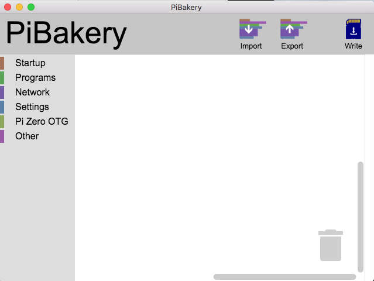
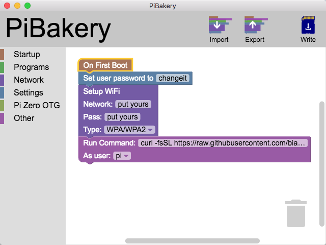
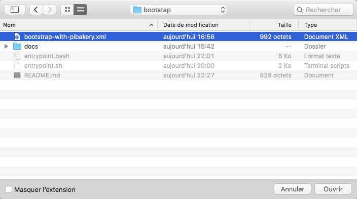
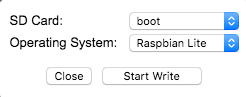
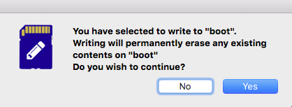
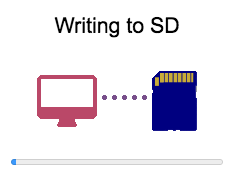

# Brothers in ARMs' project

The goal of this git repo is to provide the tools needed to setup an environment that matches the Brother In ARMS' projects requirements (basically, install docker, git and download the arm-docker-stacks repo locally).

The Supported OS are currently (actually, tests are still on-going...):
- Raspbian (running on a Raspberry 1)
- Raspbian (running on a Raspberry 3)
- Ubuntu (running on an Odroid XU4)
- Ubuntu (running on an Orange PI Win)

Are planned to be supported in the future:
- Hypriot
- Armbian
- Debian

## Bootstap the project via command line
The easiest way to launch the installation of the Brothers In ARMS's project is to run this command on a supported OS:
```
curl -fsSL https://raw.githubusercontent.com/biarms/bootstrap/master/entrypoint.sh | sh
```
An alternative to the first command could be:
```
bash <(curl -fsSL https://raw.githubusercontent.com/biarms/bootstrap/master/entrypoint.bash)
```

## Bootstap the project on a Raspberry Pi by creating an new image
If you have a Raspberry and you prefer to burn an new image, I suggest you to use the [PiBakery](http://www.pibakery.org/) tool:

### Step 1
When you will launch [PiBakery](http://www.pibakery.org/), it will look like:



### Step 2
You will then have to create this mini program:
1. On First Boot:
2. Set User password: choose the `password` of the 'pi' user you want to set (default, is 'raspberry', but it is not a good idea to not change that password.
3. Setup Wifi: provide your wifi `network name` and `wifi network password`
4. Run command: `curl -fsSL https://raw.githubusercontent.com/biarms/bootstrap/master/entrypoint.sh | sh`.



### Step 2 (alternative)
An alternative to the program creation is to download the [bootstrap-with-pibakery.xml](bootstrap-with-pibakery.xml) file,
and import it into [PiBakery](http://www.pibakery.org/) thanks to the 'Import' button.
But you will anyway have to fill your own properties (chosen user password, .



### Step 3
Once done, click on the 'Write' button. This screen should appears:



### Step 4
Confirm that you agree to erase all the existing data on that SD Card:



### Step 5
During the copy, you should see something like:



### Step 6
Put the SD Card in the Raspberry PI, ensure the Raspberry PI is connected to your network wih a ethernet
network cable (or close enough to the wifi router), turn it on, then wait.

### Step 7
Find the IP of your raspberry. Quite often (but not always), it looks like `192.168.xxx.yyy`, or sometime `10.aaa.bbb.ccc`.
If you have a screen and a keyboard plugged on the Raspberry, logs in, and when you will reach a terminal prompt, enter: `ip addr` or `ifconfig`. The result may looks like:
```
pi@raspberrypi:~ $ ip addr | grep inet
    inet 127.0.0.1/8 scope host lo
    inet6 ::1/128 scope host
    inet 192.168.0.105/24 brd 192.168.0.255 scope global eth0
    inet6 fe80::c997:3552:9acc:58b9/64 scope link
    inet 172.17.0.1/16 brd 172.17.255.255 scope global docker0
    inet 172.18.0.1/16 brd 172.18.255.255 scope global docker_gwbridge
    inet 169.254.62.203/16 brd 169.254.255.255 scope global docker_gwbridge
    inet6 fe80::82f1:97e3:6eef:a275/64 scope link
    inet 169.254.213.104/16 brd 169.254.255.255 scope global veth92e8007
    inet6 fe80::e876:17ff:fe4d:19d7/64 scope link
```
Quite often, the line with eth0 contains the solution:
```
pi@raspberrypi:~ $ ip addr | grep inet | grep eth0
    inet 192.168.0.105/24 brd 192.168.0.255 scope global eth0
```
So in that case, the IP is `192.168.0.105`

If you don't have any keyboard nor screen plug
`ping raspberrypi.local` executed on another computer could help.
```
$ ping raspberrypi.local
PING raspberrypi.local (192.168.0.105): 56 data bytes
64 bytes from 192.168.0.105: icmp_seq=0 ttl=64 time=0.515 ms
64 bytes from 192.168.0.105: icmp_seq=1 ttl=64 time=0.539 ms
```

If it doesn't work and you have a Mac, consider [PiFinder](http://ivanx.com/raspberrypi/). If you have a PC, have a look to https://www.advanced-ip-scanner.com/.
And if nothing works, [google it](https://www.google.com/search?q=find+ip+of+raspberry+pi+without+monitor) !

### Step 8
Once you've finally get this famous IP address, (in our sample, 192.168.0.105), open a browser, and type http://192.168.0.105:9000/ (with the correct IP address) to access to the Portainer console.
Or type http://192.168.0.105:8050/ (with the correct IP address) to access to the WordPress home page.

And that's it.

## What have you done ?

You have successfully :
1. Installed the latest docker-ce release (probably 18.01 or more);
2. Configure your ARM device as a docker swarm manager (OK, you're cluster have only one node. But that's may change);
3. Deploy a Portainer Docker UI admin Console to have a UI to start and stop docker services, using the port '9000'
4. Deploy the Google CAdvisor monitoring tool, currently shut down but ready to listener on port '9001' (could be easily started from the Portainer admin console)
5. Deployed a WordPress http server (including PHP), listening on port '8050'
6. Deploy an MySQL database (running inside a docker container) to store the data of the Wordpress instance

Noticed that the passwords needed to establish the connection between the Wordpress instance and the MySQL instance where generated randomly, and store:
- As secret file in docker
- As (un-encrypted) plain text files inside the '/home/pi/biarms-stacks/wordpress' folder. It is highly recommended to store these passwords in a safe place, and delete these 2 files with:
```
rm /home/pi/biarms-stacks/wordpress/db_root_password.txt
rm /home/pi/biarms-stacks/wordpress/db_password.txt
```


## Troubleshooting

In the internet connection was OK, the execution of the command: 'curl -fsSL https://raw.githubusercontent.com/biarms/bootstrap/master/entrypoint.sh | sh' should have produced a log file in
the current folder (usually, /home/pi):
```
$ pwd
/home/pi
$ ls -lrta biarms-bootstrap*.log
-rw-r--r-- 1 pi pi   886 Feb  4 21:24 biarms-bootstrap-2017-11-29-02-56-48.log
-rw-r--r-- 1 pi pi 38669 Feb  4 21:42 biarms-bootstrap-2018-02-04-21-36-53.log
-rw-r--r-- 1 pi pi  3991 Feb  4 23:23 biarms-bootstrap-2018-02-04-23-21-55.log
```

In case of issue, you could consult these logs.
```
$ more biarms-bootstrap-*.log
```

If it ends with `Brother in Arms' project bootstrap completed` it is usually a good point:
```
pi@raspberrypi:~ $ cat biarms-bootstrap-*.log | grep "project bootstrap completed"
[2018-02-04-23-43-13]-Brother in Arms' project bootstrap completed
```

Otherwise, something when wrong.
Before submitting a ticket, please sign off, sign on and relaunch the script to see if the second run is better.

If it is not the case, then feel free to contact the Brother in Arms' project team for support (via [email](project.biarms@gmail.com) or via the github issues tracking tool).


## Known issues:
### The logs ends with : 'Unable to lock the administration directory (/var/lib/dpkg/), is another process using it?'
That's a temporary error, related to the fact that 'apt-get' was already running on the system. Relauching the script when no 'apt-get' process is running will solve the pb.
### The logs ends with : 'Got permission denied while trying to connect to the Docker daemon socket at unix:///var/run/docker.sock: Get http://%2Fvar%2Frun%2Fdocker.sock/v1.35/info: dial unix /var/run/docker.sock: connect: permission denied'
When the script is executed for the first time, the user 'pi' add himself to the 'docker' group, and continue the installation. Unfortunately, some OS did that into account that user group association immediately.
Exiting the current session, relogging an relaunching the script should solve that issue.
